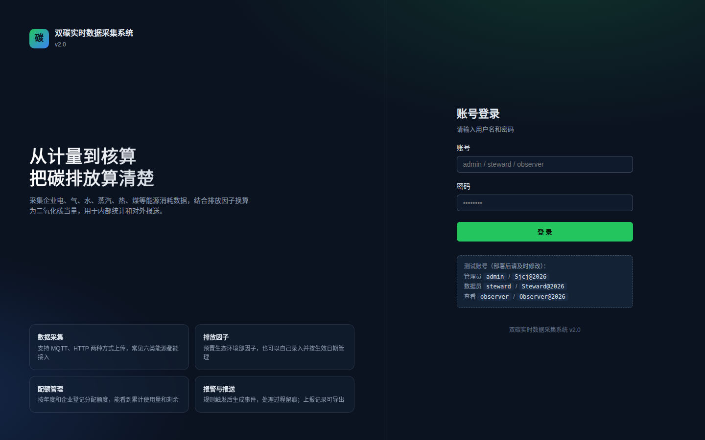
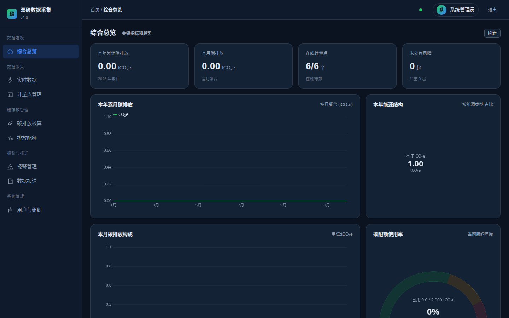
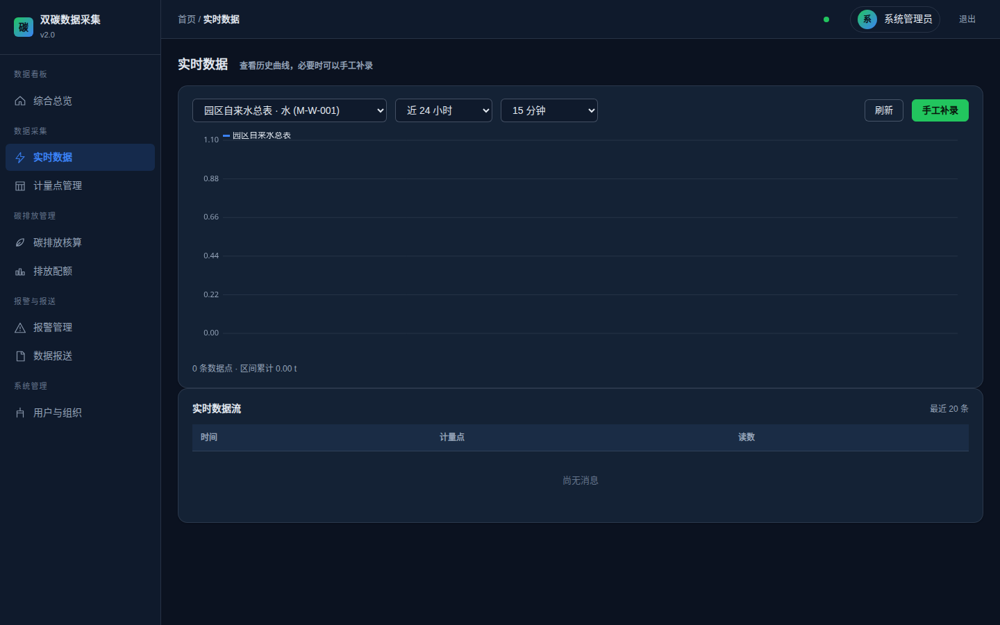
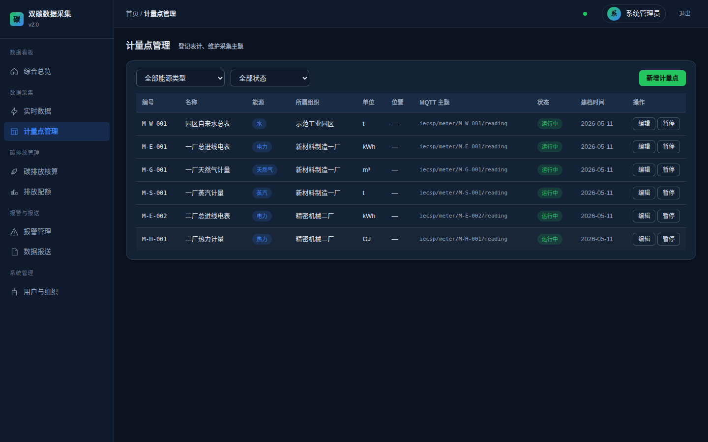
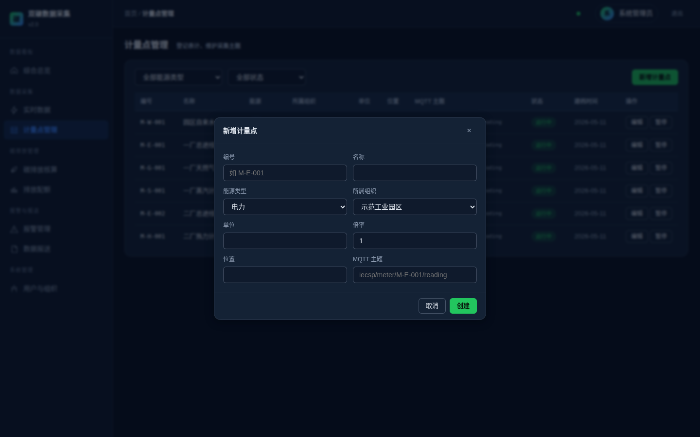
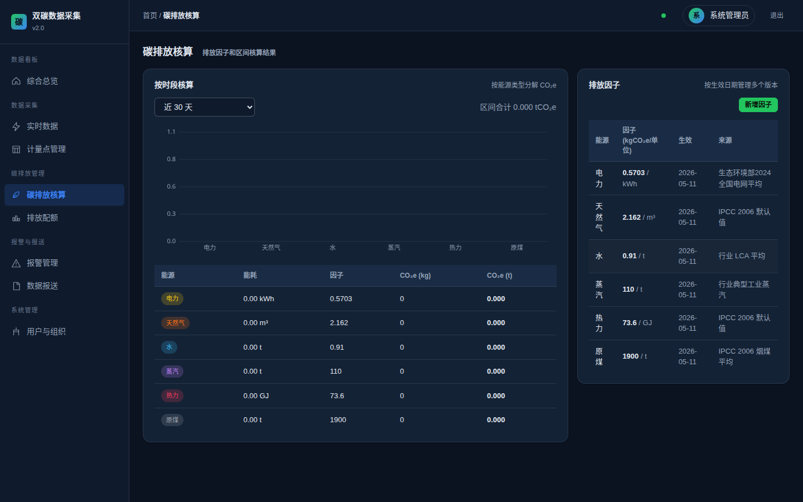
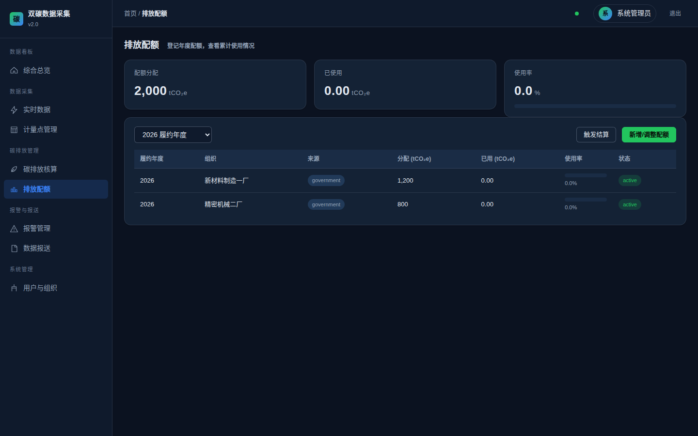
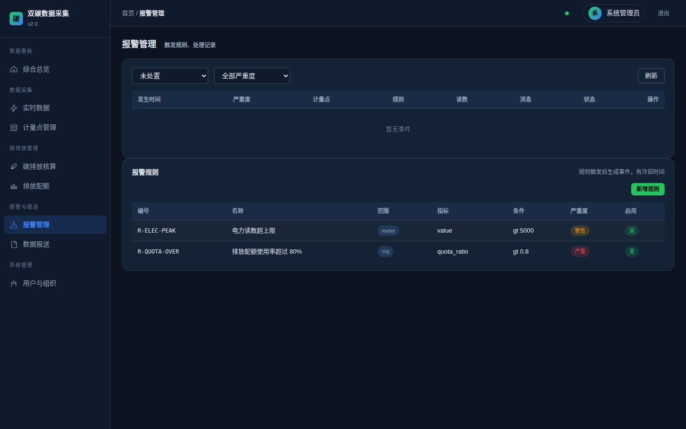
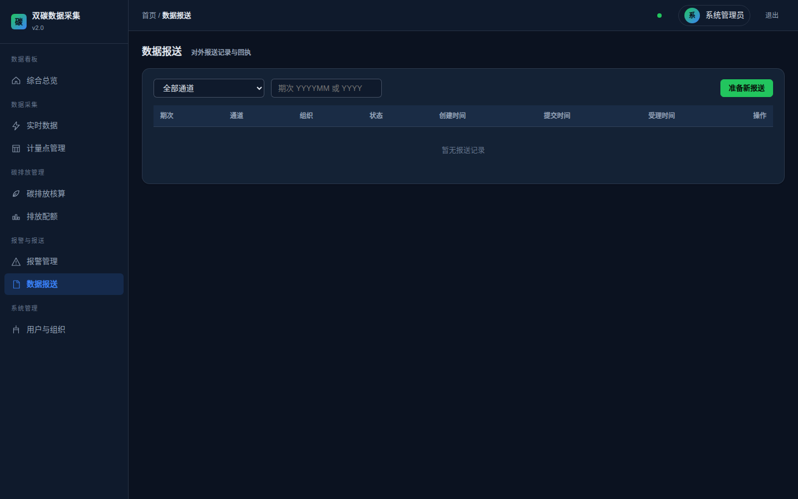
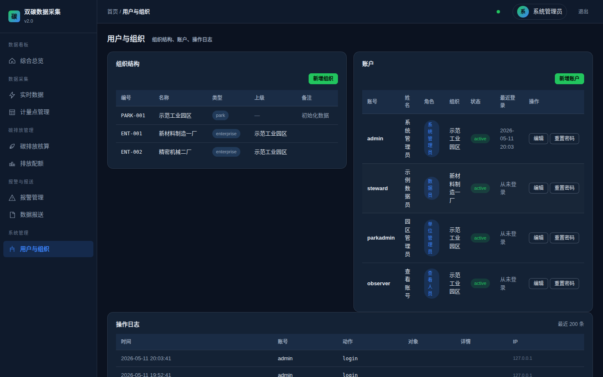

# 双碳实时数据采集系统 操作手册

软件版本：2.0
适用对象：企业能源主管、数据员、相关查看人员
编写日期：2026 年 5 月

## 第一章 系统简介

本系统用来采集企业用能数据并核算碳排放。企业现场的计量表（电表、气表、水表、热表、蒸汽表等）通过 MQTT 协议把读数上送到服务器，服务器写入时序数据库并按照排放因子换算为 CO₂e。系统提供按月、按年的统计图表，配额登记和使用进度管理，以及报警事件的处理流程。

系统是 B/S 架构，用浏览器打开就能用，不需要在客户端安装任何东西。后端跑在公司内网的一台 Linux 服务器上，数据存在服务器本地，不依赖外部云服务。

下面的章节按照菜单顺序介绍各个功能模块。如果只是初次试用，看完第二章登录、第三章综合总览就大致清楚了。

## 第二章 登录系统

打开浏览器，访问系统地址（默认是 `http://服务器IP:7090`），会自动跳转到登录页。

登录页左边是品牌区，右边是表单。输入用户名和密码后点"登 录"按钮即可。系统采用 JWT 令牌方式认证，令牌有效期 7 天，期间在同一台电脑同一浏览器中不需要重复登录。

如果输错密码会有红色提示。账号被禁用、密码到期等情况也会在这里提示原因。

系统预设了四种角色：

- 系统管理员（platform_admin）：所有权限，跨园区
- 单位管理员（park_admin）：本园区/本企业范围内的管理权限，包括人员、配额、报警规则的维护
- 数据员（data_steward）：负责数据维护，可以新建计量点、补录数据、处理报警
- 查看人员（observer）：只能看，不能改

不同角色登录后看到的菜单不一样。比如查看人员的左侧菜单里就没有"用户与组织"这一项。

部署完成后请尽快修改初始密码。修改密码的入口在右上角头像下拉菜单里。

## 第三章 综合总览

登录成功后默认进入综合总览页面，这也是系统首页。

页面上方有四张卡片，分别是：

1. 本年累计碳排放：从本年 1 月 1 日到当前时刻的累计 CO₂e（单位 t）。
2. 本月碳排放：本月的 CO₂e。
3. 在线计量点：分子是状态为"运行中"的计量点数量，分母是计量点总数。如果分子小于分母，说明有计量点处于暂停或报废状态。
4. 未处置报警：状态为 open 的报警数量，括号里会标注严重级别为"严重"的有多少起。

下方有四张图：

- 本年逐月碳排放：折线图，横轴是 1 到 12 月，纵轴是 t。把鼠标移到任意一点上会显示具体数值。
- 本年能源结构：环形图，按能源类型拆分本年累计的 CO₂e。中间显示总值。右边是图例。
- 本月碳排放构成：柱状图，按六类能源横向排列。
- 碳配额使用率：仪表盘，反映本年度配额已用百分比。绿色段是 60% 以下，黄色 60-85%，红色 85% 以上。

页面每分钟自动刷新一次，也可以点击右上角的"刷新"按钮立即拉取。

需要说明一下，曲线和柱状图的数据来源是 InfluxDB 时序库。如果系统刚刚部署、还没有数据流入，图上会是平直的零线，这是正常现象。

## 第四章 实时数据

这个页面用来看某个具体计量点的历史曲线，以及订阅服务器推送的实时数据。

页面顶部是一个工具条：

- 计量点下拉：从所有已登记的计量点中选择一个
- 时间范围下拉：近 6 小时、近 24 小时、近 7 天、近 30 天
- 聚合粒度：5 分钟、15 分钟、1 小时、1 天

选好后点"刷新"，或者直接切换下拉，下方曲线会重新加载。曲线下面有一行小字注明数据点条数和累计值。

如果需要手工补录数据（比如某段时间 MQTT 网关掉线、需要把纸面记录的读数补进系统），点右边的"手工补录"按钮。弹出的对话框里：

- 计量点和能源类型是只读的，跟着上面选的计量点走
- 数值：填入实际读数。单位会显示在标签里，请按照标签提示填入相应单位的数值，不要换算
- 时间：留空表示当前时刻，否则按填入的时间存入

补录成功后曲线会自动刷新。补录的读数会和 MQTT 接入的读数走相同的存储和核算流程。

页面底部是"实时数据流"卡片，列出最近 20 条通过 WebSocket 推送过来的消息。每收到一条新数据会自动出现在表格顶部。如果一段时间内没有收到，可能是 MQTT broker 那边没有数据，也可能是 WebSocket 断开了（右上角的绿点会变灰）。

## 第五章 计量点管理

计量点是数据采集的最小单位。系统中每一条进来的数据都必须能对应到一个已登记的计量点，否则会被丢弃。

进入计量点管理页面会看到一张表格，列出全部计量点。表头从左到右依次是：编号、名称、能源类型、所属组织、单位、位置、MQTT 主题、状态、建档时间、操作。

工具条上有两个筛选下拉，能源类型和状态。状态有三种：运行中、已暂停、已报废。点"新增计量点"按钮可以登记一条新的。

新增计量点时需要填的字段：

- 编号：业务编号，建议规则化，比如 M-E-001 表示电力计量点 001 号。一旦保存，编号不能再改。
- 名称：中文显示用，比如"一厂总进线电表"。
- 能源类型：电力、天然气、水、蒸汽、热力、原煤六选一。选了之后单位会自动填上。
- 所属组织：从组织树中选择，决定这个计量点的数据归属于哪家企业。
- 单位：可以接受默认，也可以自己改（比如把 kWh 改为 MWh）。注意改单位会影响所有历史曲线的展示。
- 倍率：比如互感器变比是 100/5，可以填 20。系统会用上送的原始值乘以这个倍率后入库。默认是 1。
- 位置：自由文字。比如"一号变电所 04 柜"。
- MQTT 主题：现场网关用什么 topic 上送这个计量点的数据。建议按 `carbon/meter/<编号>/reading` 规则填。如果暂时不接 MQTT、只用 HTTP 接口推送数据，这里可以留空。

编辑计量点时，编号和能源类型不能改，其它字段都可以改。"暂停 / 启用"按钮用来临时切换状态，不需要的计量点设为暂停即可，系统会丢弃这个计量点上送的数据，但保留历史数据。

确认计量点废弃不再使用时，可以删除（仅单位管理员及以上）。请谨慎操作，删除会清除该计量点的档案，但 InfluxDB 中的历史数据不会自动清除。

## 第六章 碳排放核算

碳排放核算就是把能源消耗量乘以排放因子，得到二氧化碳当量。比如用了 1000 度电，电力的全国电网平均排放因子是 0.5703 kgCO₂e/kWh，那么对应的碳排放就是 570.3 kg。

页面左侧是"按时段核算"。选择一个时间范围（默认是近 30 天），系统会从时序库读出这个时间窗口内每类能源的累计消耗量，然后乘以当前生效的因子，得到分能源类型的 CO₂e。

下方是一张柱状图，把六类能源的 CO₂e 横向对比。再下面是一张明细表：能源、能耗、因子、CO₂e(kg)、CO₂e(t) 五列。

页面右侧是"排放因子"。系统预置了六类能源的默认因子（IPCC 2006 和生态环境部 2024 数据）。如果企业有自己的核算依据（比如从设备供应商拿到的产品 LCA 数据），可以点"新增因子"录入。

录入因子时填的字段：

- 能源类型：六选一
- 因子值：每单位能源对应的 kgCO₂e 数量
- 单位：与该类能源的计量单位保持一致，比如电力是 kWh
- 生效起始：从哪个时间点起开始用这个因子
- 来源说明：填写参考文献或来源，比如"国家发改委 2023 通知"

同一类能源可以保留多个版本的因子。系统核算时使用对应时段内最新生效的因子。

## 第七章 排放配额

这个模块用来登记企业的年度碳排放配额，并对照实际排放量看完成情况。

页面顶部有三张卡片：配额分配总量、已使用量、使用率。第三张卡下方还有一个进度条。当使用率超过 85% 时，卡片和进度条都会变成警示色。

下方表格列出选定年度（默认是当前年度）所有组织的配额明细。每一行包括履约年度、组织、配额来源、分配量、已用量、使用率、状态。

"新增 / 调整配额"按钮用来登记一条配额记录。填的字段有：

- 履约年度：四位数年份。
- 组织：从组织树中选。
- 分配额：单位是 tCO₂e。
- 配额来源：政府无偿分配、市场购买、CCER 抵消三选一。同一组织同一年度可以同时存在多个来源的配额记录。
- 备注：选填。

"触发结算"按钮用来重新计算"已用"列。触发后，系统会读取所选年度的实际碳排放总量，按各组织配额占比分摊到"已用"字段。这是一个占位的简化算法，实际生产中应该由更精确的核算口径来更新（比如根据企业实际产品产量、采购电力来源等）。

## 第八章 报警管理

报警管理负责两件事：维护报警规则、处理报警事件。

页面上方是事件列表。可以按状态（未处置、处置中、已闭环）和严重度（严重、警告、提示）筛选。每条事件显示发生时间、严重度、计量点、触发规则、读数、消息内容、当前状态。

事件流转有三个状态：

1. 未处置（open）：刚生成，还没人接手
2. 处置中（acknowledged）：有人点了"认领处置"，记录了处理人和时间
3. 已闭环（closed）：处理完毕，可填一句"闭环说明"

数据员及以上角色都可以处理事件。原则上谁先看到谁先认领，避免重复处理。

下方"报警规则"卡片维护规则。新增规则时填的字段：

- 编号：规则唯一标识，建议有规律，比如 R-ELEC-PEAK
- 名称：规则的中文描述
- 范围：是针对单个计量点（meter）、组织（org）还是全局（global）
- 指标：瞬时值（value）或配额使用率（quota_ratio）
- 操作符：大于、小于、大于等于、小于等于
- 阈值：触发条件的数值
- 严重度：提示、警告、严重三选一
- 冷却（秒）：同一规则连续触发时的最小间隔，避免同一异常导致大量重复事件

新规则保存后立即生效，下一个上送的数据点开始检查。

## 第九章 数据报送

数据报送模块用来生成报送给政府平台的数据快照，并记录提交结果。

页面顶部可以按通道和期次筛选。下方表格列出全部报送记录。

操作步骤一般是：

1. 点"准备新报送"。弹窗中填期次（YYYYMM 表示月份，YYYY 表示年度）、组织、通道（能耗政府上报、碳排放政府上报、MRV 第三方核查）。
2. 提交后系统会生成一条 pending 状态的记录，把当时的核算结果作为 JSON 快照保存下来。
3. 实际向政府平台提交（这一步本系统目前不直接对接政府接口，需要人工操作或通过其它工具）。提交成功后，回来点这条记录右侧的"提交"按钮，状态变成 submitted。
4. 政府平台审核后，根据回执点"标记受理"或"标记驳回"。被驳回时可以填驳回原因。

"查看"按钮可以看到这条报送记录的 JSON 快照，方便核对当时上报的具体数据。

如果将来对接了政府平台 API，"提交"动作会自动调用接口而不需要人工操作。这部分接入工作目前没有完成。

## 第十章 用户与组织

这个页面只有单位管理员和系统管理员能看到。

页面分三个区域：组织结构、账户、操作日志。

### 组织结构

按"园区 - 企业 - 车间"三级树形组织。每个节点有编号、名称、类型（park / enterprise / workshop）、上级、备注。

新增组织时填的字段：编号、名称、类型、上级（可选，作为顶层组织时不选）、备注。

### 账户

列出全部账户。每条显示账号、姓名、角色、所属组织、状态（启用/停用）、最近登录时间。

新增账户的字段有：账号（登录用，唯一）、姓名、初始密码（至少 8 位）、角色、所属组织。新建的账户默认要求首次登录修改密码。

"编辑"按钮可以改姓名、角色、状态、组织。"重置密码"可以管理员直接帮用户设置一个新密码。重置之后，用户用新密码登录时还是会被强制要求改密。

### 操作日志

列出最近 200 条用户的操作记录，包括时间、账号、动作、对象、详情、IP。系统会自动记录登录、修改密码、增删改重要数据等动作。这些日志只能看，无法删除。

## 第十一章 部署说明

系统分服务端和前端两部分，前端是静态文件，由服务端直接提供，不需要单独的 Web 服务器。

部署环境要求：

- Linux 操作系统（CentOS 7+ / Ubuntu 20.04+ 都可以）
- Node.js 20 或以上
- Docker（可选，用来启动 InfluxDB 和 Mosquitto）

部署步骤如下：

1. 把代码上传到服务器，解压。
2. 复制配置文件：`cp .env.example .env`，编辑修改 JWT_SECRET。
3. 启动 InfluxDB 和 Mosquitto：`docker compose up -d influxdb mosquitto`。
4. 安装依赖：`npm install`。
5. 初始化数据库：`npm run migrate`。
6. 灌入初始数据：`npm run seed`。
7. 启动服务：`npm run build && npm start`，或者用 pm2 管理。

启动成功后，访问 `http://服务器IP:7090` 应能看到登录页。如果需要 HTTPS，可以在前面套一层 nginx 做反向代理。

升级版本时，备份好 `server/prisma/dev.db` 文件，然后替换代码，重新跑 `npm install` 和 `npm run migrate` 即可。

## 第十二章 常见问题

**Q：登录时一直转圈，最后报"网络异常"。**
A：先检查服务端进程有没有起来（用 `ps -ef | grep node` 看一下），再检查防火墙端口 7090 是否开放。

**Q：综合总览页面图表是空的。**
A：检查 InfluxDB 是否已经启动，以及最近有没有计量点上送数据。如果没有真实数据，可以通过"手工补录"或者发送 MQTT 测试消息来生成数据。

**Q：配置好计量点的 MQTT 主题，但数据进不来。**
A：先检查 Mosquitto 是否正常，可以用 `mosquitto_sub -t '#' -v` 看到没有消息。再检查 MQTT 主题拼写、消息格式是否符合约定（JSON 格式，包含 value 字段）。

**Q：忘记 admin 密码怎么办？**
A：用 SQLite 客户端打开 `server/prisma/dev.db`，找到 Account 表中 username='admin' 的记录，把 passwordHash 字段替换成新密码的 bcrypt 哈希。也可以直接重新跑 `npm run seed`，但这会重新初始化默认密码并覆盖现有 admin 的密码。

**Q：可不可以同时多个浏览器登录同一个账号？**
A：可以。系统是基于 JWT 的，多端登录互不影响。每一端的 token 独立，不会因为另一端登录而失效。
