# 双碳数据采集系统 操作手册

## 一、系统概述

双碳数据采集系统（Carbon Data Collection System）是一款面向工业企业的碳排放数据管理平台，支持多源能耗数据采集（电力、天然气、水、蒸汽）、碳排放自动核算、配额管理、告警预警和报表生成等功能，助力企业实现碳达峰与碳中和目标。

**技术架构**：前端 React 18 + Ant Design 5 + ECharts，后端 Express + TypeScript + InfluxDB 2.x + SQLite，实时通信 Socket.IO，消息队列 MQTT。

**默认管理员账号**：admin / admin123

---

## 二、系统登录

打开浏览器访问系统地址，进入登录界面。

输入用户名和密码后，点击"登录"按钮进入系统主界面。系统支持四种角色：超级管理员（super_admin）、管理员（admin）、操作员（operator）、查看者（viewer），不同角色拥有不同的操作权限。


**图1：系统登录界面**

- 输入用户名：admin
- 输入密码：admin123
- 点击"登录"按钮完成登录
- 系统采用 JWT Token 认证机制，登录后 Token 有效期为 7 天

---

## 三、碳排放总览（Dashboard）

登录成功后自动跳转至碳排放总览页面，该页面为系统首页，提供全局概览信息。

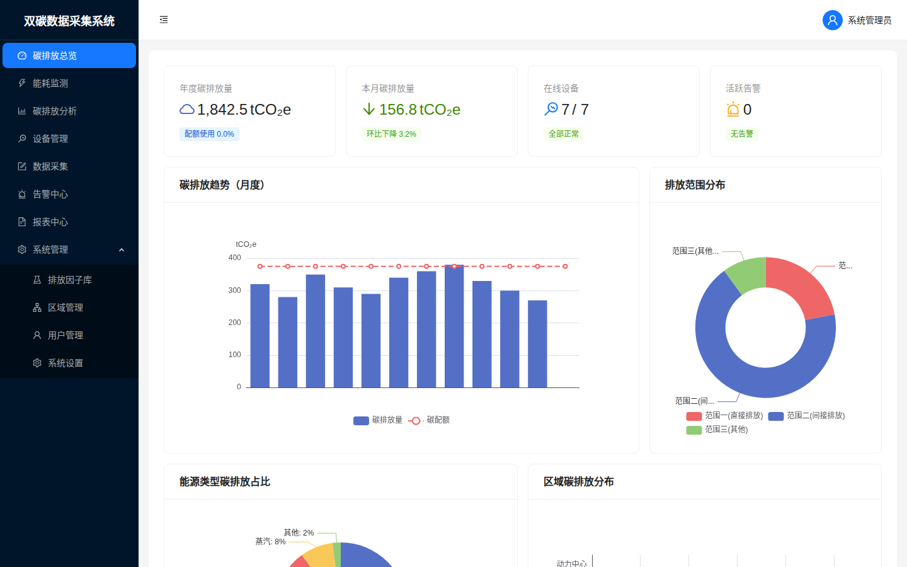

**图2：碳排放总览 - 统计卡片与趋势图**

页面上方展示四项核心指标卡片：

| 卡片 | 说明 |
|------|------|
| 年度碳排放量 | 当年累计碳排放总量（tCO₂e），及配额使用百分比 |
| 本月碳排放量 | 当月碳排放量，显示环比变化趋势（绿色下降/红色上升） |
| 在线设备 | 在线设备数/总设备数，异常状态标签提示 |
| 活跃告警 | 当前未处理告警数量，按严重/警告分类显示 |

页面中部和下部展示四组可视化图表：

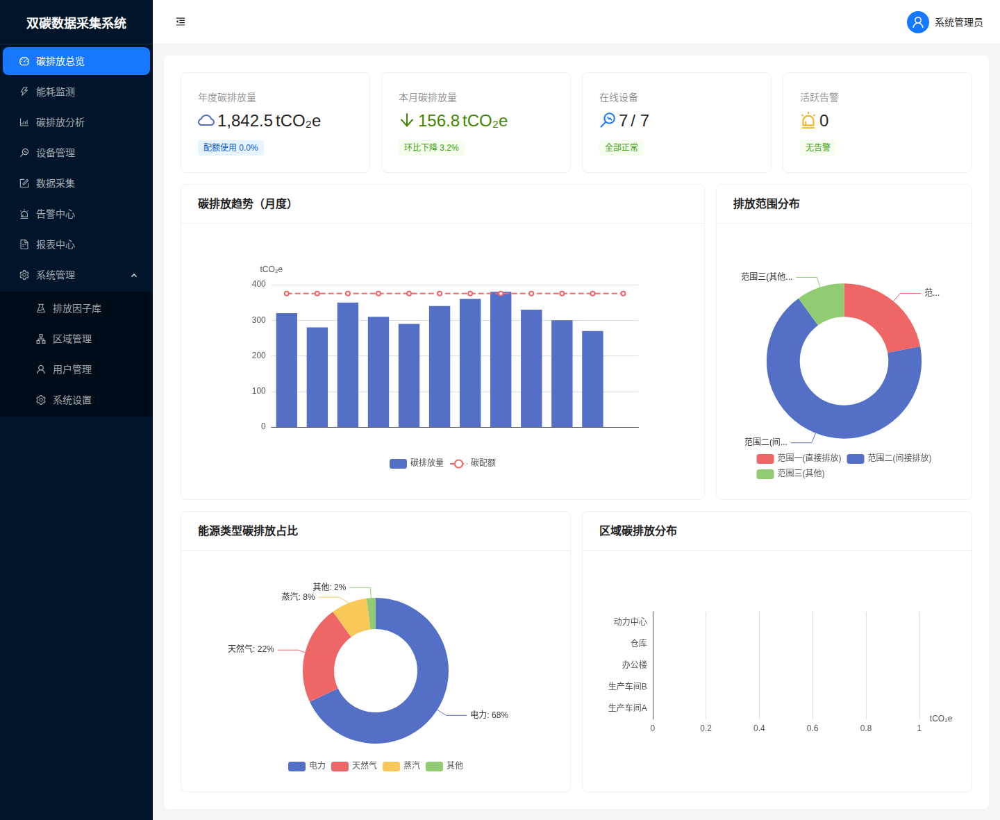

**图3：碳排放总览 - 完整页面（含下方图表）**

- **碳排放趋势（月度）**：蓝色柱状图展示各月碳排放量，红色虚线标示月度碳配额线，超额月份自动标红
- **排放范围分布**：环形图展示温室气体核算三个范围（Scope 1 直接排放、Scope 2 间接排放、Scope 3 其他间接排放）的占比
- **能源类型碳排放占比**：环形图展示电力、天然气、蒸汽、其他各能源类型的碳排放贡献比例
- **区域碳排放分布**：横向条形图对比各生产区域的碳排放量

---

## 四、能耗监测

点击左侧菜单"能耗监测"进入实时能耗监控页面。

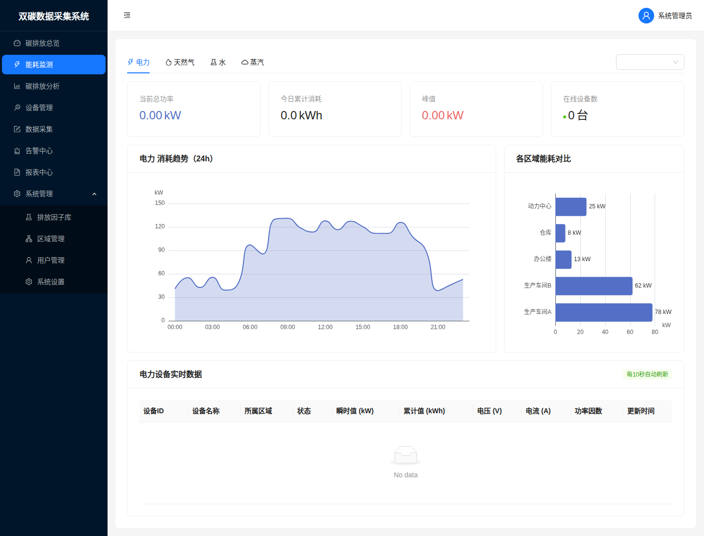

**图4：能耗监测 - 电力实时监控**

**功能说明**：

1. **能源类型切换**：顶部 Tab 栏可在电力、天然气、水、蒸汽四种能源类型间切换，每种类型显示对应的单位和数据字段
2. **区域筛选**：右上角下拉框可按区域筛选设备数据
3. **汇总统计卡片**：展示当前总功率/流量、今日累计消耗、峰值、在线设备数
4. **24小时趋势图**：面积图展示过去24小时的能耗变化曲线，白天用能高、夜间低的典型工业用能模式
5. **区域能耗对比**：横向条形图展示各区域的实时能耗排名
6. **设备实时数据表**：列出所有在线设备的详细参数（电力：电压、电流、功率因数；天然气/蒸汽：温度、压力等），每10秒自动刷新

---

## 五、碳排放分析

点击左侧菜单"碳排放分析"进入深度分析页面。

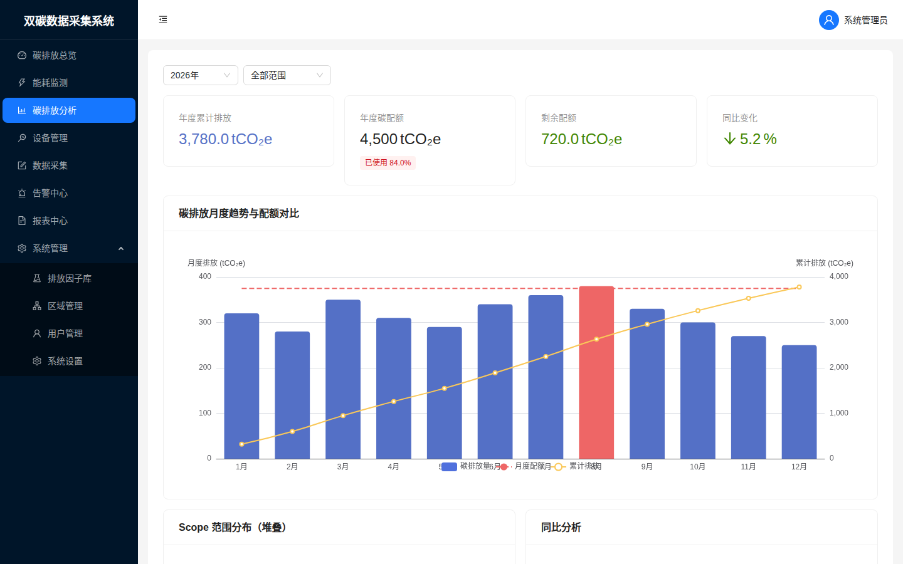

**图5：碳排放分析 - 统计卡片与月度趋势**

页面顶部提供年份和范围筛选器，下方展示四项汇总指标：

- **年度累计排放**：全年碳排放总量
- **年度碳配额**：国家/地方分配的年度碳配额额度，标注已使用百分比
- **剩余配额**：当前剩余可排放额度，绿色表示充裕、红色表示超标
- **同比变化**：与去年同期对比的变化百分比

**碳排放月度趋势与配额对比**：双Y轴图表，左轴显示月度排放柱状图（超额月份标红），右轴显示累计排放曲线，红色虚线为月度配额基准线。

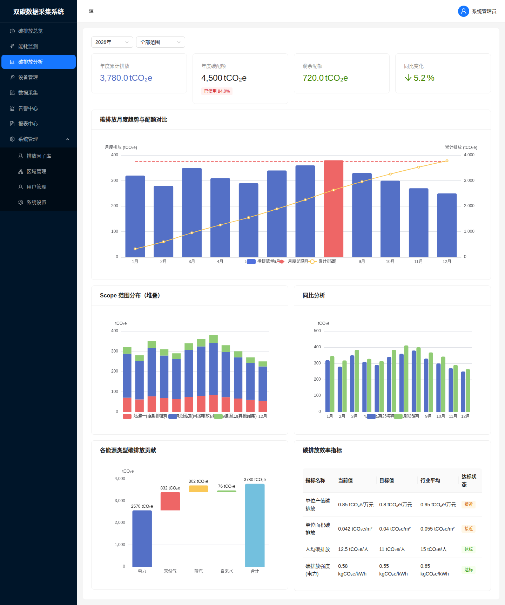

**图6：碳排放分析 - 完整页面（含 Scope 堆叠图、同比分析、效率指标）**

下半部分包含四项分析：

- **Scope 范围分布（堆叠）**：堆叠柱状图展示每月三个范围的排放构成
- **同比分析**：对比今年与去年各月排放量的双柱状图
- **各能源类型碳排放贡献**：瀑布图展示电力、天然气、蒸汽、自来水各自的排放贡献及合计
- **碳排放效率指标**：表格展示单位产值碳排放、单位面积碳排放、人均碳排放、碳排放强度等KPI，对比当前值、目标值、行业平均值，并标注达标/接近/超标状态

---

## 六、设备管理

点击左侧菜单"设备管理"进入能耗计量设备管理页面。

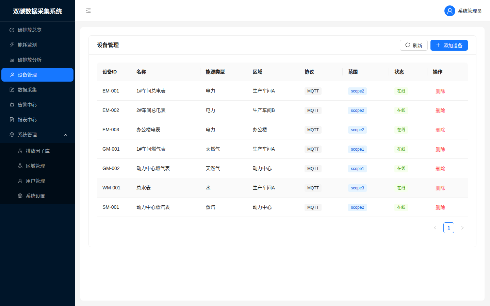

**图7：设备管理 - 设备列表**

**功能说明**：

- 设备列表展示所有计量仪表，包含设备ID、名称、能源类型、所属区域、通信协议、碳排放范围（Scope）、在线状态
- 支持按能源类型、区域、状态筛选
- 点击"刷新"按钮重新加载设备数据
- 点击"删除"可移除设备（需管理员权限）

**添加新设备**：

点击右上角"添加设备"按钮，弹出添加设备表单：

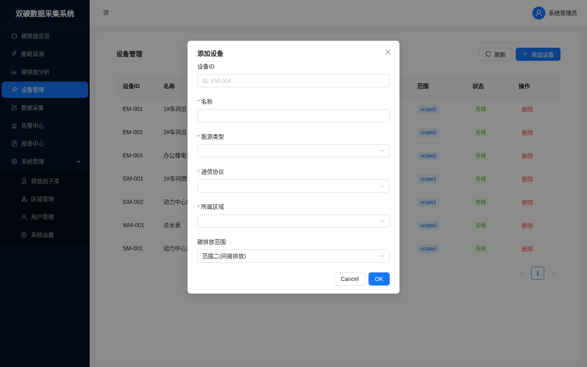

**图8：添加设备弹窗**

填写以下信息：
- **设备ID**：唯一标识，如 EM-004
- **名称**：设备描述名称
- **能源类型**：电力/天然气/水/蒸汽
- **通信协议**：MQTT/Modbus TCP/HTTP API/手动录入
- **所属区域**：选择已配置的生产区域
- **碳排放范围**：范围一（直接排放）/范围二（间接排放）/范围三（其他）

---

## 七、数据采集（手动录入）

点击左侧菜单"数据采集"进入手动数据录入页面。

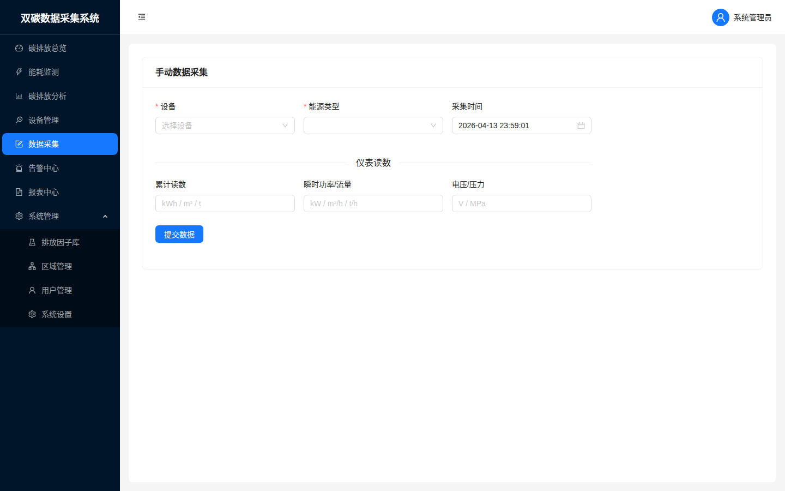

**图9：手动数据采集页面**

当设备不支持自动采集（MQTT/Modbus）时，可通过此页面手动录入仪表读数。

**操作步骤**：

1. 选择目标设备（下拉列表展示所有已注册设备）
2. 选择能源类型
3. 确认采集时间（默认为当前时间，可手动修改）
4. 在"仪表读数"区域填写：
   - **累计读数**：仪表当前累计值（kWh/m³/t）
   - **瞬时功率/流量**：当前瞬时值（kW/m³/h/t/h）
   - **电压/压力**：辅助参数（V/MPa）
5. 点击"提交数据"按钮，数据写入 InfluxDB 并自动触发碳排放重新计算

---

## 八、告警中心

点击左侧菜单"告警中心"进入告警管理页面。

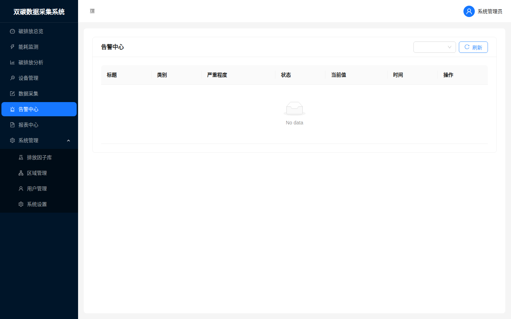

**图10：告警中心页面**

**功能说明**：

- 告警列表展示所有告警记录，包含标题、类别、严重程度（严重/警告/信息）、状态（活跃/已确认/已解除）、当前值、触发时间
- **状态筛选**：右上角下拉框可按"活跃""已确认""已解除"筛选
- **确认告警**：点击"确认"按钮，标记已知晓该告警，可添加备注
- **解除告警**：点击"解除"按钮，标记告警已处理完毕

**系统预设告警规则**：
| 规则 | 类型 | 严重度 |
|------|------|--------|
| 碳配额使用80%预警 | 碳配额 | 警告 |
| 碳配额使用95%严重预警 | 碳配额 | 严重 |
| 设备离线告警 | 设备离线 | 警告 |
| 能耗异常突增告警 | 能耗异常 | 警告 |

---

## 九、报表中心

点击左侧菜单"报表中心"进入报表管理页面。

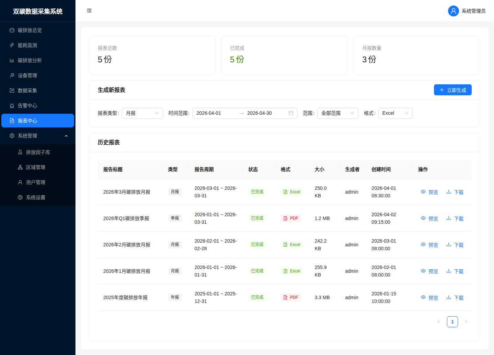

**图11：报表中心页面**

**页面结构**：

1. **统计卡片**：展示报表总数、已完成数、月报数量
2. **生成新报表**：
   - 选择报表类型：月报/季报/年报
   - 选择时间范围
   - 选择范围（全部/范围一/范围二）
   - 选择输出格式：Excel(.xlsx) 或 PDF(.pdf)
   - 点击"立即生成"按钮
3. **历史报表列表**：展示所有已生成报表，包含报告标题、类型、报告周期、状态、格式、文件大小、生成者、创建时间
4. **操作**：
   - **预览**：在线查看报表摘要数据
   - **下载**：下载报表文件到本地

---

## 十、排放因子库

点击左侧菜单"系统管理 > 排放因子库"进入排放因子管理页面。

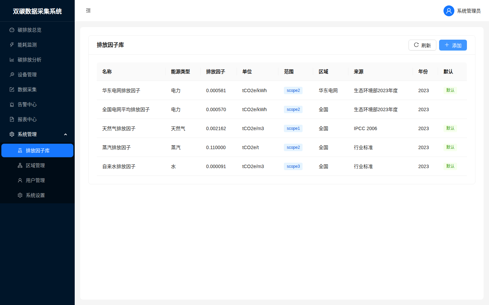

**图12：排放因子库页面**

排放因子是碳排放核算的关键参数，系统预置了以下默认排放因子：

| 名称 | 能源类型 | 排放因子 | 单位 | 范围 | 来源 |
|------|----------|----------|------|------|------|
| 华东电网排放因子 | 电力 | 0.000581 | tCO₂e/kWh | Scope 2 | 生态环境部2023年度 |
| 全国电网平均排放因子 | 电力 | 0.000570 | tCO₂e/kWh | Scope 2 | 生态环境部2023年度 |
| 天然气排放因子 | 天然气 | 0.002162 | tCO₂e/m³ | Scope 1 | IPCC 2006 |
| 蒸汽排放因子 | 蒸汽 | 0.110000 | tCO₂e/t | Scope 2 | 行业标准 |
| 自来水排放因子 | 水 | 0.000091 | tCO₂e/m³ | Scope 3 | 行业标准 |

- 标记为"默认"的因子将用于碳排放自动计算
- 可通过"添加"按钮新增自定义排放因子
- 支持按能源类型筛选

---

## 十一、系统设置 — 区域管理

点击左侧菜单"系统管理 > 系统设置"，默认显示"区域管理"选项卡。

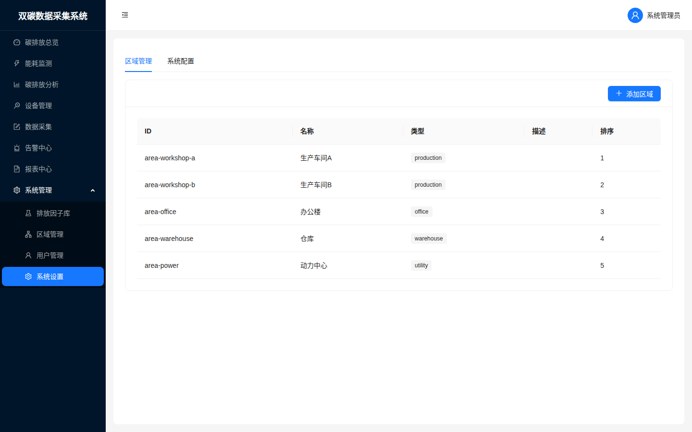

**图13：系统设置 - 区域管理**

区域（Area）用于对企业内的生产车间、办公区域进行划分管理，便于按区域统计能耗和碳排放。

- 展示所有已配置区域，包含ID、名称、类型（production/office/warehouse/utility）、描述、排序号
- 点击"添加区域"可新增区域
- 区域数据与设备绑定，用于区域级碳排放统计

---

## 十二、系统设置 — 系统配置

切换到"系统配置"选项卡，管理系统级参数。

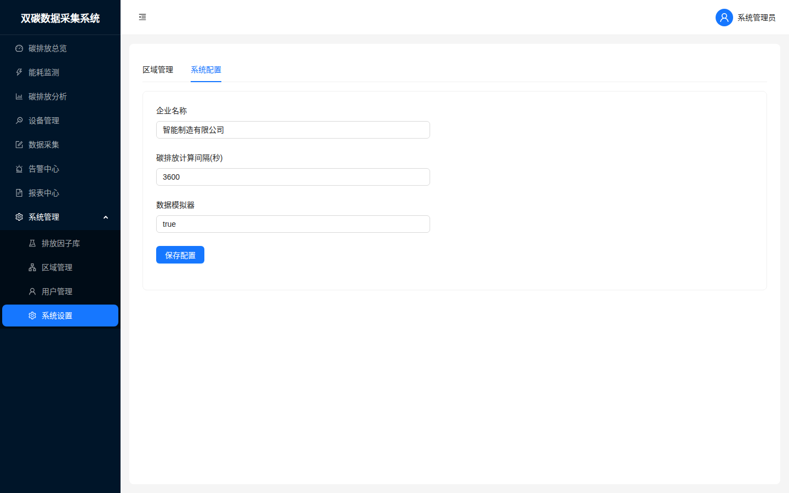

**图14：系统设置 - 系统配置**

可配置参数：

| 参数 | 说明 | 默认值 |
|------|------|--------|
| 企业名称 | 显示在系统中的企业名称 | 智能制造有限公司 |
| 碳排放计算间隔(秒) | 定时碳排放计算任务的执行间隔 | 3600（1小时） |
| 数据模拟器 | 是否启用开发环境数据模拟器 | true |

修改后点击"保存配置"按钮生效。

---

## 十三、操作流程总结

```
用户登录 → 碳排放总览（查看全局指标）
    ├── 能耗监测（实时监控各能源消耗）
    ├── 碳排放分析（深度分析与趋势对比）
    ├── 设备管理（添加/管理计量仪表）
    ├── 数据采集（手动录入仪表读数）
    ├── 告警中心（查看/处理告警）
    ├── 报表中心（生成/下载碳排放报表）
    └── 系统管理
        ├── 排放因子库（维护核算参数）
        ├── 区域管理（管理生产区域）
        └── 系统配置（修改系统参数）
```

---

*双碳数据采集系统 v1.0 操作手册*
*编制日期：2026年4月*
